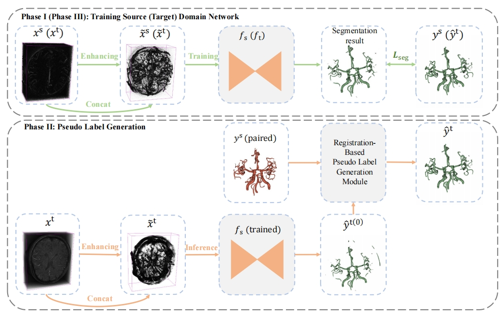

This repository contains the official implementation of our paper:

> **[Cross-Modality Cerebrovscular Segmentation Based on Pseudo-Label Generation via Paired Data]**
> 
> Zhanqiang Guo, [Jianjiang Feng](http://ivg.au.tsinghua.edu.cn/~jfeng/), Wangsheng Lu, Yin Yin,  Guangming Yang, Jie Zhou

> Paper: 

> **Abstract:** Accurate segmentation of cerebrovascular structures from Computed Tomography Angiography (CTA), Magnetic Resonance Angiography (MRA), and Digital Subtraction Angiography (DSA) is crucial for clinical diagnosis of cranial vascular diseases. Recent advancements in deep Convolution Neural Network (CNN) have significantly improved the segmentation process. However, training segmentation networks for all modalities requires significant data labeling for each modality, which is often expensive and time-consuming. To circumvent this limitation, we introduce an approach to train cross-modality cerebrovascular segmentation networks based on paired data from source and target domains. Our approach involves training a universal vessel segmentation network using source domain training data with manual labels, which automatically produces initial labels of target domain training images. We improve the initial labels of target domain training images by fusing paired images, which are then used to refine the target domain segmentation network. And a series of experimental arrangements is present for assessing the efficacy of our method in various practical application scenarios. The experiments conducted on an MRA-CTA dataset and a DSA-CTA dataset demonstrate that the proposed method is effective for cross-modality cerebrovascular segmentation and achieves state-of-the-art performance.
<br>
<p align="center">
     <br />
    <em>
    Illustration of The Proposed Cross-Modality Cerebrovascular Segmentation.
    </em>
</p>
<br>

## News
- **[Feb 22 2024]** :bell: Code is coming. 
  

## Requirements

* Python = 3.8
* Pytorch = 1.10.0
* CUDA = 11.1
* Install other packages in `requirements.txt`

###mra_data
The file structure is as follows (MRA-CTA):
```shell
root_path/data2/
├── MRA_data
├────── A0_mra.nii.gz
├────── A0_mra_frangi.nii.gz
├── MRA_label
├────── A0_mra_label.nii.gz
├── CTA_data
├────── B0_cta.nii.gz
├────── B0_cta_frangi.nii.gz
├── CTA_label
├────── B0_cta_label.nii.gz
├── data_txt
├────── train.txt
├────── test_cta.txt
└────── test_mra.txt
```

## Run

### Step I: Source Network

* **Training**.
    ```shell
    python train_seg.py --train --task 'MRA2CTA-source'
    ```

* **The inil segmentation result of target domain**.
    ```shell
    python train_seg.py --task 'MRA2CTA-source' --test_txt_path 'data2/data_txt/train.txt'  #segmentation
	python train_seg.py --task 'MRA2CTA-source' --test_txt_path 'data2/data_txt/train.txt' --test_over  #over segmentation
    ```

### Step II: Pseudo Label Generation
* **ICP-based**. 
    ```shell
    python data_process/icp_based_gene.py
    ```
* **Or VM-based**. 
    ```shell
    python train_vm.py --task 'MRA2CTA' --fix_stage_path 'model/MRA2CTA/checkpoint-source/result_train/' --train
	python train_vm.py --task 'MRA2CTA' --fix_stage_path 'model/MRA2CTA/checkpoint-source/result_train/'
	python data_process/reg_pseudo_gene.py
    ```

### Step III: Target Network
* **ICP-based**. 
    ```shell
    python train_seg.py --train --task 'MRA2CTA-target'  --label_path 'model/MRA2CTA/icp_generate_label/' #training
	python train_seg.py --task 'MRA2CTA-target' --label_path 'model/MRA2CTA/icp_generate_label/'  #inference
    ```
* **Or VM-based**. 
    ```shell
    python train_seg.py --train --task 'MRA2CTA-target' --label_path 'model/MRA2CTA/reg_generate_label/' #training
	python train_seg.py --task 'MRA2CTA-target' --label_path 'model/MRA2CTA/reg_generate_label/' #inference
    ```

## Citation
We hope you find our work useful. If you would like to acknowledge it in your project, please use the following citation:
```
TODO
```

## Contact me

If you have any questions about this code, please do not hesitate to contact me.

Zhanqiang Guo: guozq21@mails.tsinghua.edu.cn
